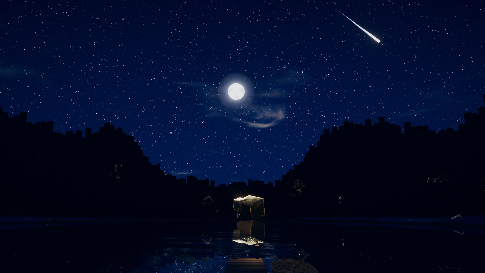
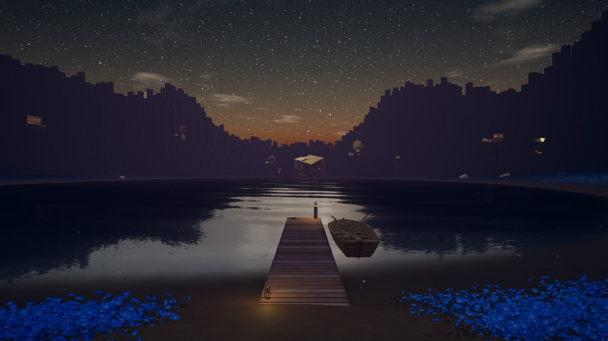
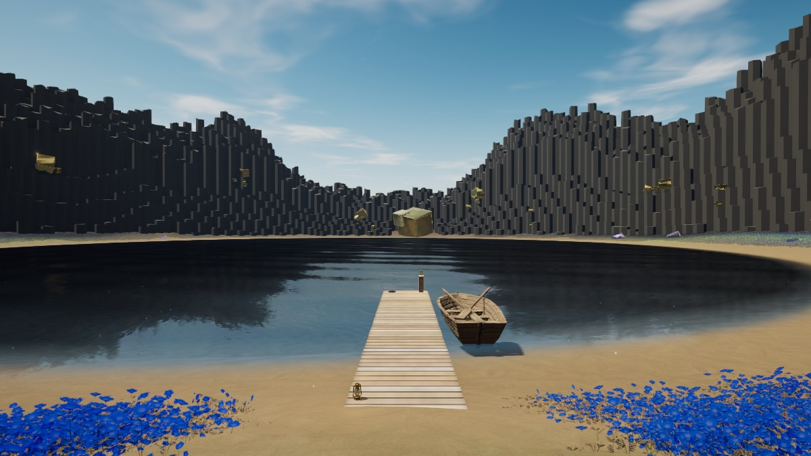
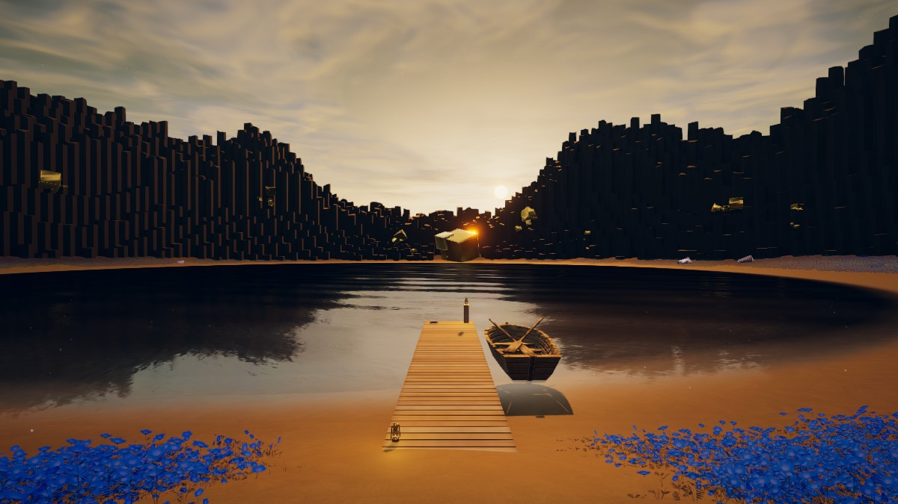
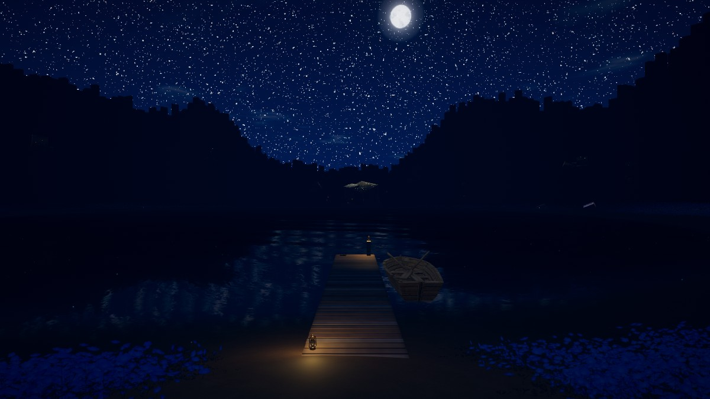
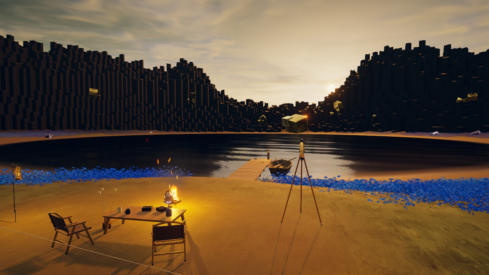
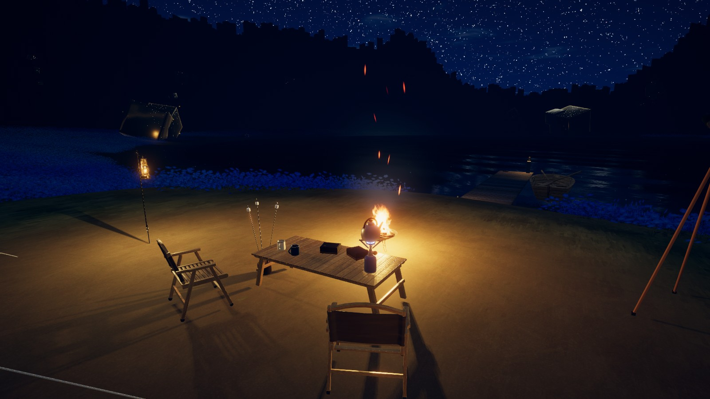
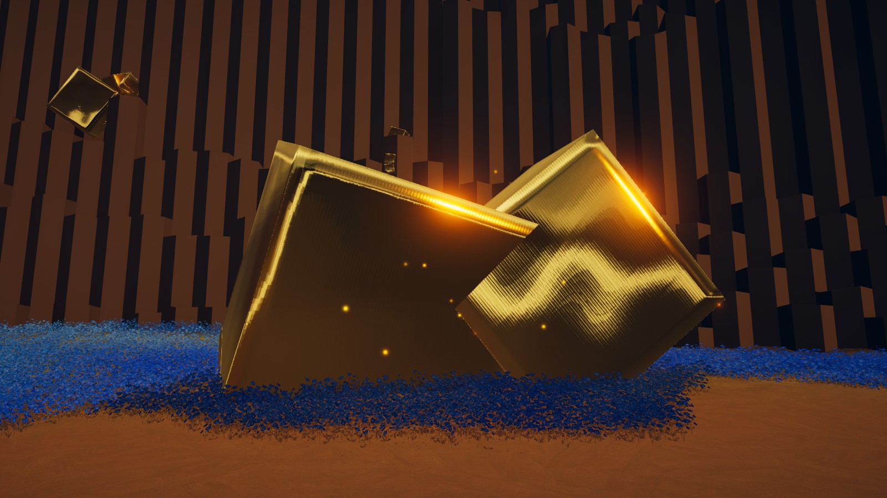
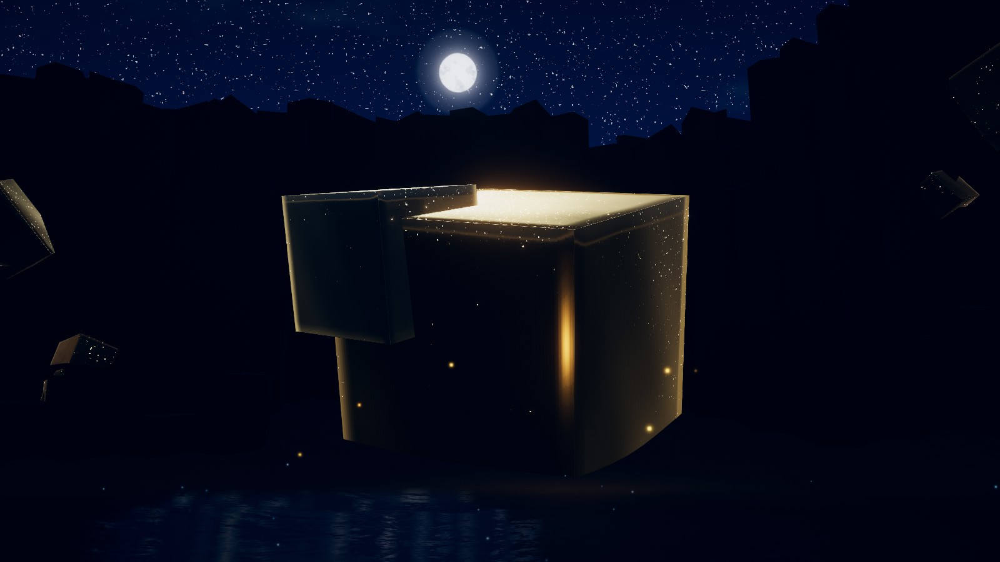
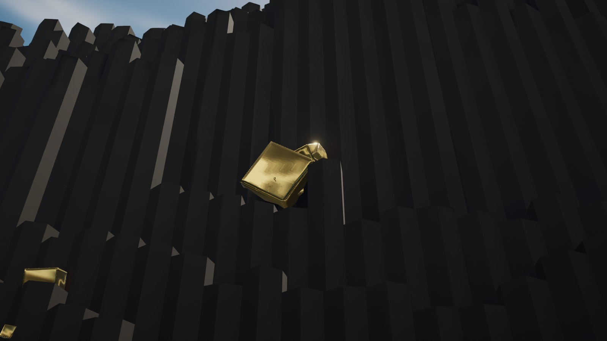

  

<h1 align="center">Pyrite Lake</h1>

  <b>황철석과 호수와 주상절리.</b> 
  기둥 절벽에 둘러싸인 호숫가 캠프, 네모필라 꽃밭과 반딧불이. 12분마다 하루가 흐릅니다. 
  Pyrite, lake, and basalt columns — a lakeside camp ringed by columnar cliffs. A full day passes every 12 minutes.

  <a href="https://vrchat.com/home/world/wrld_d9ba3584-503a-47b7-aac1-32c47d0d4311/info"><b>▶ VRChat 에서 열기</b></a>
  &nbsp;·&nbsp; PC · 최대 16명

---

## 하루

월드 시간은 24시간이 연속으로 흐른다. 하루 12분, 게임 속 1시간이 30초다. 해·달·하늘·물·결정·반딧불·환경음이 시간에 맞춰 바뀌고, 설정 패널의 슬라이더로 시간을 옮기면 같은 인스턴스의 모두에게 맞춰진다. 입장은 21:00.

| 새벽 05:48 | 정오 12:00 |
|:---:|:---:|
|  |  |
| **노을 18:30** | **밤 21:30** |
|  |  |

같은 자리(캠프에서 호수 쪽)를 네 시각에 찍었다.

| 노을의 캠프 | 밤의 캠프 |
|:---:|:---:|
|  |  |

---

## 황철석 (Pyrite)

  

이 월드의 주인공은 **황철석**이다. 금처럼 보이는 정육면체 결정이 절벽 기둥에 박혀 있고, 호숫가 땅에 반쯤 묻혀 있고, 호수 건너편에는 집채만 한 덩어리로 서 있다.

### 어떤 광물인가

| | |
|---|---|
| 화학식 | **FeS₂** — 이황화철. 철과 황으로 된 가장 흔한 황화 광물 |
| 이름 | 그리스어 *pyr*(불). 쇠나 단단한 돌에 부딪히면 **불꽃이 튄다** |
| 별명 | **바보의 금(Fool's Gold)** — 놋쇠빛 노란 금속 광택 때문에 금으로 착각했다 |
| 결정계 | 등축정계. **정육면체**, 오각십이면체(*pyritohedron* — 이 광물에서 이름을 땄다), 팔면체로 자란다 |
| 굳기 · 무게 | 모스 경도 6~6.5, 비중 약 5.0 |
| 금과 가르는 법 | 금은 무르고(2.5~3) 두드리면 펴진다. 황철석은 단단하고 부서진다. 도자기판에 그으면(조흔색) 금은 **노랑**, 황철석은 **녹흑색** |

**저절로 생긴 정육면체.** 황철석은 자르거나 갈지 않았는데도 모서리가 곧은 정육면체로 자라는 경우가 많다. 스페인 라리오하의 나바훈(Navajún)에서는 이회암 속에서 거의 완벽한 큐브가 나와서, 처음 보는 사람은 사람이 깎은 줄 안다. 이 월드의 결정이 모두 각진 상자 모양인 이유다.

**면의 줄무늬(조선).** 황철석 정육면체의 면에는 가는 줄무늬가 새겨져 있다. 이웃한 두 면의 줄무늬는 서로 **직각 방향**으로 달린다. 결정 대칭이 정육면체보다 한 단계 낮아서 생기는 흔적이다. 월드의 결정 노멀맵에도 이 가는 줄을 넣었다.

**변색.** 오래 공기에 닿은 황철석은 표면이 산화해 빛이 바래거나, 얇은 막이 생겨 무지갯빛으로 물든다. 월드에는 새 황철석(창백한 황동) 외에 빛바랜 담황색, 보랏빛이 도는 결정, 은빛 결정을 섞었다.

> 주상절리(현무암 기둥)와 황철석이 한자리에 이렇게 모여 있는 건 지질학적 재현이 아니라 **연출**이다. 검은 기둥 절벽을 배경으로 금빛 큐브가 가장 잘 보이도록 골랐다.

### 월드 안의 황철석

| 호수 건너 랜드마크 · 밤 | 절벽 광맥 · 정오 |
|:---:|:---:|
|  |  |
| 밤에는 가장자리 림 라이트와 반짝이, 주변 반딧불 | 주상절리 기둥 사이에 박힌 결정 |

| 무리 | 수 | 재질 | 자리 |
|---|---:|---|---|
| 절벽 광맥 `PyriteInCliff` | 52 | `M_Pyrite_Cliff` | 기둥에 20~35% 박혀 있다. 한 줄로 흩지 않고 **12개 광맥 × 3~5개**로 뭉쳤다 — 실제 황철석도 광맥·포켓 단위로 모여 난다 |
| 땅 위 결정 `PyriteInGround` | 16 | `M_Pyrite_Tarnish` | 반쯤 묻혀 0.45~1.4 m 드러난다. 빛바랜 담황색 |
| 강조 결정 `PyriteAccent` | 10 | `M_Pyrite_Iris` | 땅 위. 보랏빛이 도는 변색 |
| 계단 결정 `PyriteOnTerrace` | — | `M_Pyrite_Cliff` | 절벽 아래 계단 절리 위 |
| 랜드마크 `Landmark_1~3` | 3 무더기 | `M_Pyrite` · `M_Pyrite_Tarnish` · `M_Pyrite_Silver` | 호수 건너(중앙), 왼쪽 물가(두 결정이 34° 기대 섰다), 서쪽 |

결정 메시와 배치는 `Tools/python/` 스크립트로 만들었다.

### 금속으로 보이게 만들기

평평한 정육면체를 금속으로 읽히게 하는 데 세 번 걸렸다.

1. **물리 금속만 (metallic 1)** → 카키색 나무판처럼 보였다. 금속은 주변을 비춰야 금속으로 보이는데, 캠프에서 보면 결정 면에는 어두운 절벽과 호수만 비친다.
2. **+ MatCap** (`T_PyriteMatCap`, 크롬 스튜디오형 환경 그림) → 면마다 여전히 단색. 평평한 면은 법선이 하나뿐이라 MatCap 의 한 점만 찍힌다.
3. **+ 베벨·볼록면 노멀맵** (`T_PyriteFace_N`, 1024²) ✅ — 면 가장자리 7.5% 에서 최대 58° 둥글게 꺾이고, 면 전체가 ~10° 볼록하며, 가는 조선이 들어 있다. 면 안에서 법선이 변하니 그라데이션이 생기고 **모서리에 하이라이트가 맺힌다.** 결정 메시는 모든 면이 UV 0~1 이라 한 장으로 모든 모서리에 맞는다.

모든 결정은 금속도 1.0, 같은 노멀맵·MatCap 을 쓰고 색과 매끈함만 다르다.

| 머티리얼 | 알베도 (선형) | 매끈함 | |
|---|---|---:|---|
| `M_Pyrite` | 0.80 · 0.71 · 0.46 | 0.86 | 새 황철석 — 창백한 황동 |
| `M_Pyrite_Cliff` | 0.66 · 0.58 · 0.38 | 0.78 | 절벽·계단 — 한 톤 어둡고 덜 매끈하게. 어두운 벽 앞에서 하늘만 비쳐 흰 카드처럼 뜨는 걸 막는다 |
| `M_Pyrite_Tarnish` | 0.96 · 0.91 · 0.70 | 0.80 | 빛바랜 담황색 |
| `M_Pyrite_Iris` | 0.66 · 0.60 · 0.70 | 0.88 | 보랏빛이 도는 변색 |
| `M_Pyrite_Silver` | 0.80 · 0.82 · 0.86 | 0.90 | 은빛 |

### 밤의 결정

밤에는 비칠 빛이 거의 없어 금속이 까맣게 죽는다. 그래서 셰이더 `Pyrite/PyriteMetal` 에 밤 전용 항을 더하고, 시간 스크립트(`PyriteDayCycle`)가 시각마다 세기를 바꾼다. 낮에는 전부 0.

- **림** — 가장자리에 따뜻한 금빛 테 (밤 0.35)
- **달 반짝임** — 달 방향으로 맺히는 가짜 반사 (2.5). 달이 높을 때 윗면이 환하게 빛난다
- **반짝이** — 1 m 당 28칸으로 나눈 월드 격자마다 임의의 법선을 줘서 모래알처럼 반짝인다 (4)
- **반딧불 · 작은 불빛** — 랜드마크마다 반딧불 무리(최대 30, 호수 건너 120 m 에서도 점으로 보이게 최소 크기 고정)와 캠프 쪽 옆에 범위 6 m 의 따뜻한 점광원

호수 반사를 켜면 이 반짝이까지 물에 비친다.

---

## 할 수 있는 것

캠프 테이블 위 **설정 프로젝터**를 누르면 패널이 열린다 (EN / KO, 나에게만 보임). 처음 온 사람에게는 자동으로 열리고, 설정은 VRChat Persistence 로 다음 방문에도 남는다.

| | |
|---|---|
| 시간 | 분 단위 슬라이더, 자동 흐름 (모두에게 동기화) |
| 화면 | 밝기, 블룸 |
| 반사 | 호수 반사, 캠프 거울 |
| 소리 | 환경음 크기 |
| 성능 | 꽃 보이는 거리, 반딧불, 해 그림자, 불빛 그림자 |

**상호작용 13종** — 설정 프로젝터 · 영상 프로젝터(ProTV) · 손거울 · 랜턴(들고 다니다 걸이에 걸기) · 의자 · 야전침대 · 돗자리 · 마시멜로(불에 굽고 먹기) · 주전자와 스토브 · 머그(따르고 마시기) · 망원경 · 물수제비 돌 · 나룻배. 머그·마시멜로·돌은 모두에게 동기화되고 효과음이 난다.

**그 밖에** — 밤마다 호수 쪽 하늘에 별똥별(인스턴스의 모두가 같은 순간에 본다), 새벽 호수의 낮은 물안개, 수면 파문, 모닥불 불티.

---

## 만든 방법

- Unity 2022.3.22f1 · VRChat SDK Worlds 3.10.5 · UdonSharp · ProTV 3.0
- 지형·절벽 기둥(1,350개)·결정·부두·꽃 밀도·환경음은 `Tools/python/` 스크립트로 생성
- 씬 변경은 모두 **에디터 스크립트**(`Assets/Editor/Pyrite*.cs`, 메뉴 `Tools ▸ Pyrite` / `Tools ▸ Pyrite2`)로 했다. 손으로 씬을 만지지 않고, 메뉴마다 되돌리기가 있다
- 조명: Baked Indirect + 시간대별 반사 큐브맵, 밤 전용 라이팅(`PyriteNight.cginc`)으로 구운 조명만 어둡게
- 효과음 4종(물보라·따르기·마시기·한입)은 numpy 로 합성한 절차적 사운드

이 README 의 사진 중 맨 위 한 장은 인게임 스크린샷, 나머지는 에디터 렌더(`Tools ▸ Pyrite2 ▸ Z41a. README Shots`)다. 인게임과 색·밝기가 조금 다를 수 있다.

---

## 이 저장소에 없는 것

**유료·서드파티 에셋은 재배포 금지라 포함하지 않는다.** 클론한 뒤 Booth 에서 받은 패키지를 다시 임포트해야 한다. 패키지의 GUID 가 같으므로 씬·머티리얼 참조는 임포트만 하면 그대로 이어진다.

| 폴더 | 에셋 |
|---|---|
| `Assets/つきのすとあ/` | FlowersGrassland (つきのすとあ) |
| `Assets/Noagami/` | のあがみ キャンプ＆焚火アセット |
| `Assets/Sakana-Water/` | サカナ VRC向け水面シェーダー |
| `Assets/Sorafield Atmosphere Sky/` · `Sorafield Procedural Skies - VRChat Addon/` | Sorafield Atmosphere Sky |
| `Assets/WoodBoat/` | 木製ボート (ootwn) |
| `Assets/Flora/Generated/` | 위 꽃 에셋에서 합쳐 만든 파생 메시 |
| `Assets/TerrainAssets/T_grass_dusk.png` · `T_Ground_dusk.png` | 꽃 팩 지면 텍스처를 색만 누른 파생본 |
| `M_LakeWater.mat` · `M_Sky_PyriteDusk.mat` | 위 패키지 폴더 안에서 조정한 머티리얼 — 값은 `PyriteTunedMaterials.cs` 에 있음 |

## 복구 순서

1. VCC 에 저장소 추가: `https://vpm.techanon.dev/index.json` (ProTV), Settings ▸ Packages ▸ **Show Pre-Release Packages** 켜기
2. VCC ▸ Add Existing Project 로 이 폴더를 열면 `Packages/vpm-manifest.json` 기준으로 SDK·ProTV 가 복원된다
3. Unity 를 열고 위 Booth 패키지 5개 임포트
4. `Tools ▸ Pyrite ▸ A2. Rebuild Dusk Ground Textures` — 지면 텍스처 재생성 + 지형 레이어 재연결
   `Tools ▸ Pyrite ▸ A3. Recreate Tuned Materials` — 호수 물·황혼 하늘 머티리얼을 원래 GUID 로 재생성
5. `Tools ▸ Pyrite ▸ I. Build Flower Field Meshes` — 꽃 파생 메시 재생성
6. `Tools ▸ Pyrite ▸ F. Bake Lighting Now` → `T. Bake Reflection Sets`

## 생성 스크립트

`Tools/python/` — 지형 높이맵·스플랫맵·절벽·결정·부두·꽃 밀도·환경음을 만든 파이썬 스크립트. (황철석 노멀맵/MatCap 은 결과 PNG 만 `Assets/TerrainAssets` 에 보관)
Unity 밖에서 돌려 만든 결과물(`Terrain.raw`, `Splat4.bin`, `Assets/Meshes/*.obj`, `Assets/Audio/*.wav` 등)의 원본이다.
경로가 제작 당시 작업 환경 기준이라 그대로 돌리려면 입출력 경로를 맞춰야 한다.

## 크레딧

- Flowers & Grassland — ©つきのすとあ (https://tsukino-vr.booth.pm/items/8154089)
- キャンプ＆焚火アセット — のあがみ
- VRC向け水面シェーダー — サカナ-sakanasan- (https://booth.pm/ja/items/7882111)
- 木製ボート — ootwn
- Sorafield Atmosphere Sky — SoraField (https://sorafield.booth.pm/)
- ProTV — ArchiTechVR
- Noto Sans KR — Google Fonts (SIL Open Font License)
- UdonSharp — Merlin · VRChat SDK — VRChat

지형 · 절벽 · 결정 · 부두 · 셰이더 · 효과음은 Pyrite9 가 직접 만들었다.

## 규약

- 월드는 **Public** — 위 유료 에셋 모두 퍼블릭 월드 사용 허용 (재배포는 불가라 저장소에 없음)
- ProTV 는 잠금 상태로 시작한다 (`Tools ▸ Pyrite ▸ W. Lock Media Player`) — 인스턴스 마스터·소유자·슈퍼유저만 영상 변경
- 제작 기록은 Claude 프로젝트 문서(`world-pyritehome-*.md`, `PyriteHome_00_현재상태.md`)에 있다
